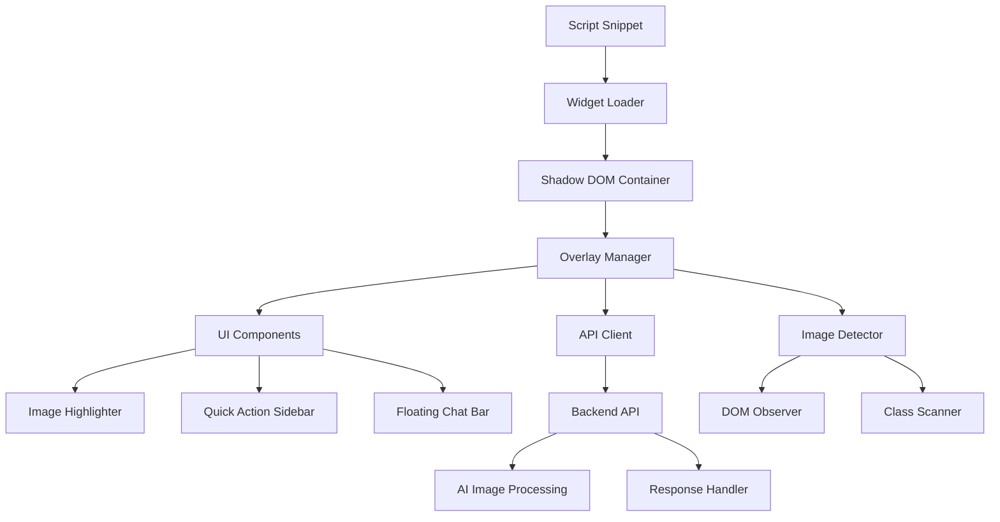

# Design Document

## Overview

The DinoOverlay Code Snippet System is a standalone JavaScript widget that can be injected into any website via a simple script tag. The system transforms existing room images into interactive, AI-editable elements through a glassmorphic overlay interface. The architecture follows a modular, framework-agnostic approach using Shadow DOM for style isolation and a clean separation between frontend UI and backend AI processing.

## Architecture

### High-Level Architecture



### Core Components

1. **Widget Loader**: Initializes the overlay system and creates the Shadow DOM container
2. **Overlay Manager**: Orchestrates all overlay components and manages state
3. **Image Detector**: Scans for `.editable-room` images and attaches event listeners
4. **UI Components**: Modular glassmorphic interface elements
5. **API Client**: Handles communication with the backend AI services

### Technology Stack

- **Frontend**: TypeScript + React (compiled to vanilla JS bundle)
- **Styling**: Tailwind CSS with glassmorphic utilities
- **Bundling**: Vite/Rollup for single-file distribution
- **Isolation**: Shadow DOM for CSS and DOM encapsulation
- **Backend**: Node.js/Express API with AI integration endpoints

## Components and Interfaces

### 1. Widget Loader (`DinoOverlayLoader`)

**Purpose**: Entry point that initializes the overlay system

```typescript
interface DinoOverlayConfig {
  apiEndpoint?: string;
  apiKey?: string;
  theme?: 'light' | 'dark' | 'auto';
  enableAnalytics?: boolean;
}

class DinoOverlayLoader {
  private config: DinoOverlayConfig;
  private shadowRoot: ShadowRoot;
  
  constructor(config: DinoOverlayConfig);
  public initialize(): Promise<void>;
  private createShadowDOM(): void;
  private loadStyles(): void;
  private mountOverlay(): void;
}
```

### 2. Overlay Manager (`OverlayManager`)

**Purpose**: Central state management and component coordination

```typescript
interface OverlayState {
  selectedImage: SelectedImage | null;
  sidebarVisible: boolean;
  chatBarVisible: boolean;
  isProcessing: boolean;
  currentAction: string | null;
}

interface SelectedImage {
  element: HTMLImageElement;
  rect: DOMRect;
  borderRadius: string;
}

class OverlayManager {
  private state: OverlayState;
  private components: Map<string, Component>;
  
  public selectImage(image: HTMLImageElement): void;
  public clearSelection(): void;
  public updateImagePosition(): void;
  public setState(updates: Partial<OverlayState>): void;
}
```

### 3. Image Detector (`ImageDetector`)

**Purpose**: Scans DOM for editable images and manages detection lifecycle

```typescript
interface DetectionConfig {
  className: string;
  observeChanges: boolean;
  debounceMs: number;
}

class ImageDetector {
  private observer: MutationObserver;
  private detectedImages: Set<HTMLImageElement>;
  
  public startDetection(): void;
  public stopDetection(): void;
  private scanForImages(): HTMLImageElement[];
  private attachImageListeners(image: HTMLImageElement): void;
  private calculateImageBounds(image: HTMLImageElement): DOMRect;
}
```

### 4. UI Components

#### Image Highlighter (`ImageHighlighter`)

```typescript
interface HighlighterProps {
  selectedImage: SelectedImage;
  onClose: () => void;
}

class ImageHighlighter extends Component {
  private glowAnimation: Animation;
  
  public render(): HTMLElement;
  private createGlowBorder(): HTMLElement;
  private startGlowAnimation(): void;
  private matchImageBorderRadius(): string;
}
```

#### Quick Action Sidebar (`QuickActionSidebar`)

```typescript
interface QuickAction {
  id: string;
  label: string;
  icon: string;
  prompt: string;
}

interface SidebarProps {
  visible: boolean;
  position: { x: number; y: number };
  onActionClick: (action: QuickAction) => void;
  onClose: () => void;
}

class QuickActionSidebar extends Component {
  private actions: QuickAction[];
  
  public render(): HTMLElement;
  private createActionButton(action: QuickAction): HTMLElement;
  private slideIn(): Animation;
  private slideOut(): Animation;
}
```

#### Floating Chat Bar (`FloatingChatBar`)

```typescript
interface ChatBarProps {
  visible: boolean;
  position: { x: number; y: number };
  onSubmit: (message: string) => void;
  isProcessing: boolean;
}

class FloatingChatBar extends Component {
  private inputElement: HTMLInputElement;
  
  public render(): HTMLElement;
  private handleSubmit(message: string): void;
  private showTypingIndicator(): void;
  private hideTypingIndicator(): void;
}
```

### 5. API Client (`APIClient`)

**Purpose**: Handles all backend communication with proper error handling

```typescript
interface EditImageRequest {
  imageData: string; // base64
  prompt: string;
  imageUrl?: string;
  context?: {
    propertyId?: string;
    roomType?: string;
  };
}

interface EditImageResponse {
  success: boolean;
  editedImageUrl?: string;
  editedImageData?: string;
  error?: string;
  processingTime?: number;
}

interface ChatRequest {
  message: string;
  imageContext?: string;
  conversationId?: string;
}

interface ChatResponse {
  success: boolean;
  response?: string;
  suggestions?: string[];
  error?: string;
}

class APIClient {
  private baseUrl: string;
  private apiKey: string;
  
  public async editImage(request: EditImageRequest): Promise<EditImageResponse>;
  public async sendChatMessage(request: ChatRequest): Promise<ChatResponse>;
  private async makeRequest<T>(endpoint: string, data: any): Promise<T>;
  private handleApiError(error: any): void;
}
```

## Data Models

### Core Data Structures

```typescript
// Image processing data
interface ImageData {
  originalUrl: string;
  base64Data: string;
  dimensions: { width: number; height: number };
  format: string;
}

// UI positioning data
interface Position {
  x: number;
  y: number;
  width: number;
  height: number;
}

// Animation configuration
interface AnimationConfig {
  duration: number;
  easing: string;
  delay?: number;
}

// Theme configuration
interface ThemeConfig {
  glassmorphism: {
    background: string;
    backdropBlur: string;
    border: string;
    shadow: string;
  };
  colors: {
    primary: string;
    secondary: string;
    accent: string;
    text: string;
  };
}
```

### State Management

```typescript
interface GlobalState {
  overlay: OverlayState;
  ui: UIState;
  api: APIState;
  config: DinoOverlayConfig;
}

interface UIState {
  theme: 'light' | 'dark' | 'auto';
  animations: boolean;
  responsiveBreakpoint: number;
}

interface APIState {
  isConnected: boolean;
  lastRequestTime: number;
  rateLimitRemaining: number;
  errorCount: number;
}
```

## Error Handling

### Error Categories

1. **Network Errors**: API connectivity issues, timeouts, rate limiting
2. **Image Processing Errors**: Invalid image formats, size limits, processing failures
3. **DOM Errors**: Missing elements, permission issues, browser compatibility
4. **Configuration Errors**: Invalid API keys, malformed config, missing dependencies

### Error Handling Strategy

```typescript
interface ErrorHandler {
  handleNetworkError(error: NetworkError): void;
  handleImageError(error: ImageError): void;
  handleDOMError(error: DOMError): void;
  handleConfigError(error: ConfigError): void;
}

class ErrorManager implements ErrorHandler {
  private errorQueue: Error[];
  private retryAttempts: Map<string, number>;
  
  public handleError(error: Error): void;
  private shouldRetry(error: Error): boolean;
  private showUserError(message: string): void;
  private logError(error: Error): void;
}
```

### User-Facing Error Messages

- **Network Issues**: "Unable to connect to AI service. Please check your connection."
- **Image Processing**: "Image processing failed. Please try a different image."
- **Browser Compatibility**: "Your browser doesn't support this feature. Please update or try a different browser."
- **Rate Limiting**: "Too many requests. Please wait a moment before trying again."

## Testing Strategy

### Unit Testing

- **Component Testing**: Each UI component tested in isolation
- **API Client Testing**: Mock backend responses and error scenarios
- **Image Detection Testing**: DOM manipulation and event handling
- **State Management Testing**: State transitions and side effects

### Integration Testing

- **End-to-End Workflows**: Complete user interactions from image selection to AI processing
- **Cross-Browser Testing**: Chrome, Firefox, Safari, Edge compatibility
- **Framework Compatibility**: WordPress, React, Vue, plain HTML integration
- **Performance Testing**: Bundle size, load times, memory usage

### Testing Tools

```typescript
// Jest configuration for unit tests
interface TestConfig {
  testEnvironment: 'jsdom';
  setupFilesAfterEnv: ['<rootDir>/src/test/setup.ts'];
  moduleNameMapping: {
    '\\.(css|less|scss)$': 'identity-obj-proxy';
  };
}

// Playwright for E2E testing
interface E2ETestConfig {
  browsers: ['chromium', 'firefox', 'webkit'];
  baseURL: 'http://localhost:3000';
  testDir: './tests/e2e';
}
```

### Test Coverage Requirements

- **Unit Tests**: Minimum 90% code coverage
- **Integration Tests**: All critical user paths covered
- **Performance Tests**: Bundle size < 200KB, load time < 2s
- **Accessibility Tests**: WCAG 2.1 AA compliance

## Performance Considerations

### Bundle Optimization

- **Tree Shaking**: Remove unused code from final bundle
- **Code Splitting**: Lazy load non-critical components
- **Compression**: Gzip/Brotli compression for CDN delivery
- **Caching**: Aggressive caching with versioned URLs

### Runtime Performance

- **Virtual Scrolling**: For large image galleries
- **Debounced Events**: Scroll and resize event handling
- **Memory Management**: Cleanup event listeners and observers
- **Image Optimization**: WebP format support, lazy loading

### Monitoring and Analytics

```typescript
interface PerformanceMetrics {
  loadTime: number;
  bundleSize: number;
  apiResponseTime: number;
  errorRate: number;
  userEngagement: {
    imagesSelected: number;
    actionsTriggered: number;
    chatMessages: number;
  };
}

class AnalyticsCollector {
  public trackEvent(event: string, data: any): void;
  public trackPerformance(metrics: PerformanceMetrics): void;
  public trackError(error: Error): void;
}
```

## Security Considerations

### Content Security Policy

- **Script Sources**: Restrict to trusted CDN domains
- **Image Sources**: Allow data: URLs for base64 images
- **Connect Sources**: Limit API endpoints to configured domains

### Data Protection

- **Image Data**: Temporary storage only, automatic cleanup
- **API Keys**: Client-side encryption, secure transmission
- **User Privacy**: No persistent tracking, opt-in analytics

### XSS Prevention

- **Input Sanitization**: All user inputs sanitized before processing
- **Shadow DOM Isolation**: Prevents CSS and JS leakage
- **CSP Headers**: Strict content security policies enforced

## Deployment and Distribution

### CDN Strategy

```typescript
interface CDNConfig {
  primary: 'https://cdn.dinooverlay.com/v1/overlay.js';
  fallback: 'https://backup-cdn.dinooverlay.com/v1/overlay.js';
  integrity: 'sha384-...'; // Subresource integrity hash
}
```

### Version Management

- **Semantic Versioning**: Major.Minor.Patch format
- **Backward Compatibility**: Support for previous major version
- **Migration Guides**: Documentation for breaking changes
- **Feature Flags**: Gradual rollout of new features

### Integration Examples

```html
<!-- Basic Integration -->
<script>
  (function(){
    var s=document.createElement('script');
    s.src="https://cdn.dinooverlay.com/v1/overlay.js";
    s.async=true;
    s.onload=function(){
      DinoOverlay.init({
        apiEndpoint: 'https://api.dinooverlay.com',
        apiKey: 'your-api-key'
      });
    };
    document.head.appendChild(s);
  })();
</script>

<!-- Advanced Configuration -->
<script>
  DinoOverlay.init({
    apiEndpoint: 'https://api.dinooverlay.com',
    apiKey: 'your-api-key',
    theme: 'auto',
    enableAnalytics: true,
    customActions: [
      { id: 'vintage', label: 'Vintage Style', prompt: 'Apply vintage styling' }
    ]
  });
</script>
```